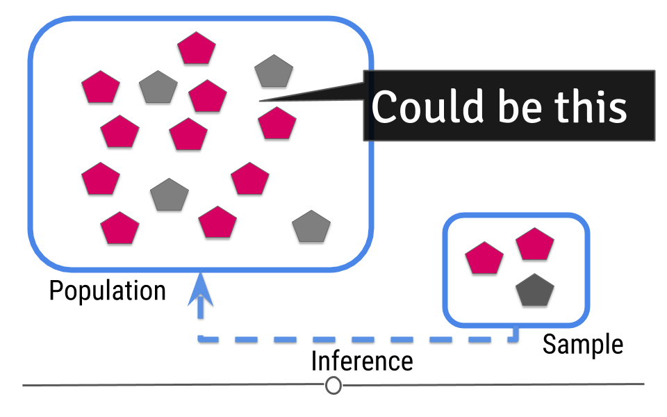
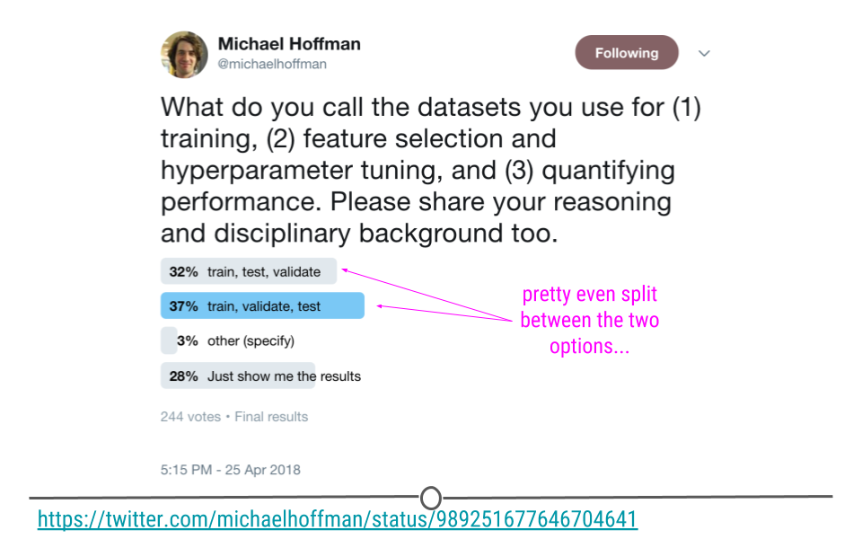
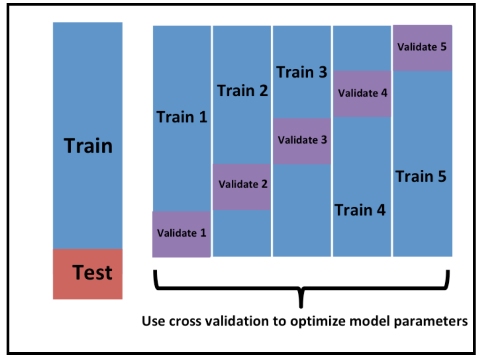

```{r setup, include=FALSE}
knitr::opts_chunk$set(echo = TRUE, 
                      message = FALSE, 
                      warning = FALSE,
                      fig.align = "center")
```

<!-- Add interesting quote -->


# Pre-lecture materials

### Read ahead

:::resources

**Before class, you can prepare by reading the following materials:**

1. https://rafalab.github.io/dsbook/introduction-to-machine-learning.html

:::


### Acknowledgements

Material for this lecture was borrowed and adopted from

- https://jhu-advdatasci.github.io/2019/lectures/16-intro-ml.html
- https://rafalab.github.io/dsbook/introduction-to-machine-learning.html

# Learning objectives

:::keyideas

**At the end of this lesson you will:**

- Be able to define machine learning (ML) and why we use it?
- Be able to recognize some misuses of ML
- Understand the parts of a ML problem 
- Implement a machine learning model to classify images into two types: clouds and axes

:::


# Why machine learning?

Today we are going to be talking about machine learning. This is one of the _hottest_ areas in all of statistics/data science. Machine learning is in the news a ton lately. Some examples include: 

* [Self driving cars](https://towardsdatascience.com/your-guide-to-ai-for-self-driving-cars-in-2020-218289719619)
* [Predicting poverty with satellites](http://science.sciencemag.org/content/353/6301/790)
* [Predicting breast cancer using Google's DeepMind AI](https://ai.googleblog.com/2017/03/assisting-pathologists-in-detecting.html)
* [Predictive policing](https://www.youtube.com/watch?v=MfThopD7L1Y)

This is such a big idea that universities are investing major dollars to hire faculty in [AI and machine learning](https://www.seas.harvard.edu/news/2021/10/seven-join-harvard-computer-science-faculty). 

On a more personal note you might be interested in AI and machine learning because it is one of the most in demand parts of being a data scientist right now. If you get really good at it [you can make a lot of money](https://www.nytimes.com/2018/04/19/technology/artificial-intelligence-salaries-openai.html). 

The other really exciting reason to focus on AI and ML right now is that there is a lot of room for statistical science. Some of the biggest open problems include: 

* [Fairness in machine learning](https://developers.google.com/machine-learning/fairness-overview/) - tons of work on sampling, causal inference, etc. 
* [Morality in machine learning](https://www.nature.com/articles/d41586-018-07135-0) - studies of psychology, bias, reporting. 

There are a ton more, including how to do EDA for machine learning, understanding the potential confounders and bias, understanding the predictive value of a positive and more. 


# What is machine learning?

Ok so machine learning is super hot right now, but what is machine learning really? You may have learned about the central dogma of statistics that you sample from a population

```{r cdi1, echo=FALSE, fig.cap='Central dogma of statistics: inference (part 1)', out.width = '60%', fig.align='center'}
knitr::include_graphics("../../images/cdi1.png")
```

[[**Source**](https://github.com/jtleek/intro-ml-2018)]


Then you try to guess what will happen in the population from the sample. 

```{r cdi2, echo=FALSE, fig.cap='Central dogma of statistics: inference (part 2)', out.width = '60%', fig.align='center'}

```

[[**Source**](https://github.com/jtleek/intro-ml-2018)]


For prediction, we have a similar sampling problem

```{r cdp1, echo=FALSE, fig.cap='Central dogma of statistics: prediction (part 1)', out.width = '60%', fig.align='center'}
knitr::include_graphics("../../images/cdp1.png")
```

[[**Source**](https://github.com/jtleek/intro-ml-2018)]

But now we are trying to build a rule that can be used to predict a single observation's value of some characteristic using the others. 

```{r cdp2, echo=FALSE, fig.cap='Central dogma of statistics: prediction (part 2)', out.width = '60%', fig.align='center'}
knitr::include_graphics("../../images/cdp2.png")
```

[[**Source**](https://github.com/jtleek/intro-ml-2018)]


We can make this more concrete with a little mathematical notation. 


### Notation

_This section borrowed from  Rafa Irizarry's excellent [Data Science Book](https://rafalab.github.io/dsbook/introduction-to-machine-learning.html)_

In machine learning, data comes in the form of:

1. the **outcome** we want to predict and 
2. the **features** that we will use to predict the outcome.

Here, we will use $Y$ to denote the outcome and $X_1, \dots, X_p$ to denote features. Note that features are sometimes referred to as predictors or covariates. We consider all these to be synonyms.

:::keyideas

**Goal**: we want to build an algorithm that takes feature values as input and returns a prediction for the outcome when we do not know the outcome. 

The **machine learning approach** is to _train_ an algorithm using a dataset for which we do know the outcome to **identify patterns in the training data**, and then apply this algorithm in the future to make a prediction when we do not know the outcome.

:::


#### Types of prediction problems 

Prediction problems can be divided into categorical and continuous outcomes. 

For categorical outcomes, $Y$ can be any one of $K$ classes. The number of classes can vary greatly across applications.
For example, in the digit reader data, $K=10$ with the classes being the digits 0, 1, 2, 3, 4, 5, 6, 7, 8, and 9. In speech recognition, the outcome are all possible words or phrases we are trying to detect. Spam detection has two outcomes: spam or not spam. 

In this lesson, we denote the $K$ categories with indexes $k=1,\dots,K$. However, for binary data we will use $k=0,1$ for mathematical conveniences.

#### The general set-up

The general set-up is as follows. We have a series of features and an unknown outcome we want to predict:

```{r, echo=FALSE}
library(dplyr)
n <- 1
tmp <- data.frame(outcome=rep("?",n), 
                  feature_1 = paste0("X_1"),
                  feature_2 = paste0("X_2"),
                  feature_3 = paste0("X_3"),
                  feature_4 = paste0("X_4"),
                  feature_5 = paste0("X_5"))
tmp %>% knitr::kable(align="c")
```

To _build a model_ that provides a prediction for any set of values $X_1=x_1, X_2=x_2, \dots X_5=x_5$, we collect data for which we know the outcome:

```{r, echo=FALSE}
n <- 10
tmp <- data.frame(outcome = paste0("Y_", 1:n), 
                  feature_1 = paste0("X_",1:n,",1"),
                  feature_2 = paste0("X_",1:n,",2"),
                  feature_3 = paste0("X_",1:n,",3"),
                  feature_4 = paste0("X_",1:n,",4"),
                  feature_5 = paste0("X_",1:n,",5"))
tmp %>% knitr::kable()
```

We use the notation $\hat{Y}$ to denote the prediction. We use the term _actual outcome_ to denote what we ended up observing. So we want the prediction $\hat{Y}$ to match the _actual outcome_. 


### ML as an optimization problem

The central problem in machine learning can be thus written very simply as minimizing a distance metric. Let $\hat{Y} = f(\vec{X})$ then our goal is to minimize the distance from our estimated function of the predictors to the actual value. 

$$d(Y - f(\vec{X}))$$

$d(\cdot)$ could be something as simple as the mean squared distance or something much more complex. The bulk of machine learning research in theoretical computer science and statistics departments focuses on defining different values of $d$ and $f$. We will talk a bit more about this in the next lesson. 

### The parts of an ML problem

A machine learning problem consists of a few different parts and its important to consider each one. To solve a (standard) machine learning problem you need: 

1. A data set to train from. 
2. An algorithm or set of algorithms you can use to try values of $f$ (e.g. logistic regression, random forest, support vector machine)
3. A distance metric $d$ for measuring how close $Y$ is to $\hat{Y}$ (e.g. mean squared error)
4. A definition of what a "good" distance is (e.g. different types of performance metrics)

While each of these components is a _technical_ problem, there has been a ton of work addressing those technical details. The most pressing open issue in machine learning is realizing that though these are _technical_ steps they are not _objective_ steps. 

:::keyideas 

In other words, how you choose the data, algorithm, metric, and definition of "good" says what you value and can dramatically change the results. A couple of cases where this was a big deal are: 

1. [Machine learning for recidivism](https://www.propublica.org/article/machine-bias-risk-assessments-in-criminal-sentencing) - people built ML models to predict who would re-commit a crime. But these predictions were based on historically biased data which led to biased predictions about who would commit new crimes. 
2. [Deciding how self driving cars should act](https://www.nature.com/articles/d41586-018-07135-0) - self driving cars will have to make decisions about how to drive, who they might injure, and how to avoid accidents. Depending on our choices for $f$ and $d$ these might lead to wildly different kinds of self driving cars. 

**Try out** the [moralmachine](http://moralmachine.mit.edu/) to see how this looks in practice. 

:::


# Example: QuickDraw!

Quick,Draw! is an online game where you are given an object to draw (like a cello, axe, airplane, etc.) and then you have to draw it with your finger. Then a pre-trained deep learning algorithm is applied to guess what kind of a drawing you have made. You can try it out here. 

* https://quickdraw.withgoogle.com/


One **interesting thing** about this project and something to keep in mind if you are thinking about ways to get cool data is the exchange that Google is making here. They are giving you a fun game to play for free and in return you are giving them a ton of free data. This is the same exchange made by other successful startups: 

- [reCAPTCHA](https://www.google.com/recaptcha/intro/v3.html) you click on images to prove you are a human, they give you access to a website. 
- [DuoLingo](https://www.duolingo.com/) you practice learning words, they collect information on the way you say those words or your translations


Before going any further, we load a few R packages we will need 

```{r, message=FALSE, warning=FALSE}
library(here)
library(LaF)  # Fast Access to Large ASCII Files
library(ggplot2)
library(caret)
library(dplyr)
library(rjson)
library(tibble)
library(Hmisc)
library(tidyr)
library(rpart.plot)
library(pheatmap)
```

:::keyideas 

The **main steps in a machine learning problem** are: 

1. Question definition
2. Goal setting
3. Data collection
4. Training/testing/validation splits
5. Data exploration
6. Data processing
7. Model selection and fitting
8. Model evaluation

:::

We will use the Quick, Draw! dataset to discuss a few different parts of the ML process. 


## Start with a question

This is the most commonly missed step when developing a machine learning algorithm. ML can very easily be turned into an engineering problem. Just dump the outcome and the features into a black box algorithm and viola! 

```{r choc-nobel, echo=FALSE, out.width = '90%', fig.align='center'}
knitr::include_graphics("../../images/choc-nobel.jpg")
```

But this kind of thinking can lead to major problems. In general good ML questions:

1. Have a plausible explanation for why the features predict the outcome. 
2. Consider potential variation in both the features and the outcome over time
3. Are consistently re-evaluated on criteria 1 and 2 over time. 

For example, there is a famous case where Google predicted Flu outbreaks based on search results. But the way people searched (due to changes in the algorithm, changes in culture, or other unexplained reasons) led to variation in the search terms people were using. This led to the algorithm predicting [wildly badly](https://gking.harvard.edu/files/gking/files/0314policyforumff.pdf) over time. 

```{r gft, echo=FALSE, out.width = '90%', fig.align='center'}
knitr::include_graphics("../../images/gft.png")
```


This is just one example of a [spurious correlation](http://tylervigen.com/spurious-correlations), which is one of the big worries. In general all of the [reasons for skepticism](https://jhu-advdatasci.github.io/2019/lectures/07-being-skeptical.html) apply here. 

:::questions

In our QuickDraw! example, there are a ton of interesting analyses you could do with these data, but we are going to start with something simple. 
**Can we predict from the drawing data what kind of object was drawn?** To make matters even simpler we are going to just look at a couple of types of images: axes and clouds. 

:::

## Goal setting

One important part of any machine learning problem is defining what success looks like. This choice very much depends on the application and what you are trying to do. 

For example, when we talk about the goal in ML we are usually talking about the error rate we want to minimize and how small we want to make it. Consider for each observation we have an outcome $y$ and a set of features $\vec{x}$. Our goal is to create a function $\hat{y} = \hat{f}(\vec{x})$ such that the distance, $d(y,\hat{f}(\vec{x}))$, between the observed and the predicted $y$ is minimized. 

The two most common distances that show up in machine learning (and the ones you will always be using if you don't change the defaults!) are: 

- **Root mean squared error (RMSE)** - this is the most common error measure for regression (**read: continuous outcome**) problems.
    - $d(y,\hat{f}(\vec{x})) = \sqrt{\sum_i \left(y_i-\hat{f}(\vec{x}_i)\right)^2}$
- **Accuracy** - this is the most common error measure for classification (**read: factor outcomes**) problems. 
    - $d(y,\hat{f}(\vec{x})) = \sum_i 1\left(y=\hat{f}(\vec{x})\right)$
    
Here, we are going to use simple accuracy and say that anything better than guessing is "good enough".

But in general there are a number of other potential error measures: 

```{r errors, echo=FALSE, out.width = '100%', fig.align='center'}
knitr::include_graphics("../../images/errors.png")
```

Here are a few examples of how they might be relevant. 

- **Predictive value of a positive** - in classification if one group is much less frequent than another, then even high sensitivity/high specificity tests can produce lots of false positives (the classic example is cancer screening, but very relevant for any screening problem). So the PPV = probability that subjects with a positive screening test truly have the disease.
- **Mean absolute error** - in regression sometimes you want your error to be less sensitive to a few outliers (this might be true in predicting highly skewed outcomes like income or property values) and MAE can reduce the influence of those outliers. 
- **Specificity** - when the cost of a false negative is really high compared to a false positive and you never want to miss any negatives (say for example missing a person standing in front of a self driving car)

In general, you need to spend a good amount of time thinking about what the _goal_ is, what the tradeoff of various different errors are and then build that into your model. 


## Data collection

Here, we will focus on one somewhat unique issue that arises often in ML problems - the data are often huge and not sampled randomly. 

:::questions 

**Questions**:

- We know that a 5% random sample is better than a 5% non-random sample in measurable ways (e.g. bias, uncertainty assessment).

- But is an 80% non-random sample "better" than a 5% random sample in measurable terms? 90%? 95%? 99%? (Jeremy Wu 2012)

- "Which one should we trust more: a 1% survey with 60% response rate or a non-probabilistic dataset covering 80% of the population?" (Keiding and Louis, 2016, Journal of Royal Statistical Society, Series B)

:::

There is a pretty detailed, but really [good paper](https://statistics.fas.harvard.edu/files/statistics-2/files/statistical_paradises_and_paradoxes.pdf) addressing this question by Xiao-Li Meng. 

The **surprising answer** is that it depends! If there is correlation between the outcome value and the sampling probability even huge data sets can actually be very small in "effective sample size". So it is worth thinking _very hard_ about potential correlation between the outcome and the (designed or de facto) sampling scheme. 

```{r ss-bigdata, echo=FALSE, out.width = '60%', fig.align='center'}
knitr::include_graphics("../../images/ss-bigdata.png")
```

#### Back to quick draw

OK back to our example. Google has released [some of the data](https://github.com/googlecreativelab/quickdraw-dataset) from the Quick, Draw! challenge. You can either get the data in raw form or you can get some pre-processed data. 

I downloaded the pre-processed data sets for clouds and axes. These data are available from [Google Cloud Platform](https://console.cloud.google.com/storage/browser/quickdraw_dataset/full/simplified).

- Align the drawing to the top-left corner, to have minimum values of 0.
- Uniformly scale the drawing, to have a maximum value of 255.
- Resample all strokes with a 1 pixel spacing.
- Simplify all strokes using the Ramer–Douglas–Peucker algorithm (strokes are simplified) with an epsilon value of 2.0.

All these things make data easier to manage and to represent into a plot. This already represents a lot of work, but even so we still have some more pre-processing to do. 

First, we are going to load some of the data into R, it comes in [ndjson](http://ndjson.org/) (new line delimited JSON) format and there are lots of drawings. 

```{r}
if(!file.exists(here("data", "axe.ndjson"))){
  file_url_axe <- paste0("https://storage.googleapis.com/quickdraw_dataset/full/simplified/axe.ndjson")
  download.file(file_url_axe, 
                destfile=here("data", "axe.ndjson"))

  file_url_cloud <- paste0("https://storage.googleapis.com/quickdraw_dataset/full/simplified/cloud.ndjson")
  download.file(file_url_cloud, 
                destfile=here("data", "cloud.ndjson"))

}
list.files(here("data"))
```

Next, we are going to read in 100 drawings of each class using the 
`sample_lines()` function from the `LaF` package. 

```{r, eval=FALSE}
?LaF::sample_lines
```

We will start with the axes: 

```{r}
set.seed(123)
axes_json = LaF::sample_lines(here("data","axe.ndjson"), n = 100) 
length(axes_json)
```

And repeat for clouds: 

```{r}
set.seed(123)
clouds_json = LaF::sample_lines(here("data","cloud.ndjson"), n = 100)
length(clouds_json)
```

## Data loading and EDA


Before we talk about data exploration and processing, it is important to _look_ at your data and _think_ about what you find in it. 

:::keyideas 

**Important**: I want to point out you should do this **exploration only in the training set**. However, **in this example**, we are going split the data at a later point. 

If you want to know more about this concept, read about [data leakage](https://en.wikipedia.org/wiki/Leakage_(machine_learning)). 

:::

OK the data are not in a format we can do anything with yet. Each line is a json object: 

```{r}
axes_json[[1]]
```

```{r gf, echo=FALSE, out.width = '80%', fig.align='center'}

```

[[Source](https://giphy.com/gifs/the-godfather-cMNJ5t5HrnWMpwe5Zt)]

The next thing I did was google ["quick draw data ndjson rstats"](https://www.google.com/search?q=quick+draw+data+ndjson+rstats). I found [a tutorial](https://fronkonstin.com/2018/07/01/exploring-the-quick-draw-dataset-with-r-the-mona-lisa/) and lifted some code for processing ndjson data into data frames. 

```{r}
parse_drawing <- function(list){
  lapply(list$drawing, function(z) {tibble(x=z[[1]], y=z[[2]])}) %>% 
    bind_rows(.id = "line") %>% 
    mutate(drawing=list$key_id, row_id=row_number())
}
```

What is this code doing? 

- `drawing` is a named element that we are going to work with in each of the json objects
- `x` and `y` contain the coordinates for the locations
- `bind_rows()` from `dplyr` is similar to `do.call(rbind)` in base R to bind many data frames in to one. Here the use of the `.id` argument is like a data frame identifier. You can think of `line` as drawing a single stroke (or line) when you draw something on a page.
- Finally, we add two new columns: `drawing` which contains an ID for each drawing (`key_id`) and `row_number()` creates a tracker for each drawing. 

Ok let's try geting our first axe out:

```{r}
first_axe <-
  rjson::fromJSON(axes_json[[1]]) %>% 
  parse_drawing()
first_axe
```

Ok this doesn't look like much, but we could plot it to see if it looks like an axe. 

```{r}
first_axe %>% 
  ggplot(aes(x=x, y=y)) +
    geom_point() + 
    scale_x_continuous(limits=c(0, 255))+
    scale_y_reverse(limits=c(255, 0))+
    theme_minimal()
```


This sort of looks OK, but maybe a better way to look at it is to actually draw the lines?

**Hint**: check out `line` in the `first_axe` data frame and the `geom_path()` geom in `ggplot2`

```{r, eval=FALSE}
?geom_path
```

Putting it all together

```{r}
first_axe %>% 
  ggplot(aes(x=x, y=y)) +
    geom_path(aes(group = line), lwd=1)+
    scale_x_continuous(limits=c(0, 255))+
    scale_y_reverse(limits=c(255, 0))+
    theme_minimal()
```

Hey that sort of looks like an axe! 

:::questions

**Questions**: 

- How many `line`s are there in this drawing? 
- How would we filter to just draw the second line? 

```{r}
### try it out 

```

:::

OK let's see another one.

```{r}
rjson::fromJSON(axes_json[[2]]) %>% 
    parse_drawing() %>% 
    ggplot(aes(x=x, y=y)) +
    geom_path(aes(group = line), lwd=1)+
    scale_x_continuous(limits=c(0, 255))+
    scale_y_reverse(limits=c(255, 0))+
    theme_minimal()
```

:::keyideas 

**Pro tip**: If we were doing this for real, I would make plots for a large sample of these, understand the variation (and look for mislabeled drawings, messed up observations, etc.). 

:::

Next let's look at a cloud

```{r}
rjson::fromJSON(clouds_json[[1]]) %>% 
    parse_drawing() %>% 
    ggplot(aes(x=x, y=y)) +
    geom_path(aes(group = line), lwd=1)+
    scale_x_continuous(limits=c(0, 255))+
    scale_y_reverse(limits=c(255, 0))+
    theme_minimal()
```


Yup, looks like a cloud! You can see how the x and y axis align in the top left corner. 

## Data pre-processing 


### Feature engineering

One of the key issues in building a model is feature engineering. Feature engineering is a step in a machine learning model where we construct the covariates (or features, $\vec{x}$) that you will feed into the prediction algorithms. 

#### Unstructured data 

Feature engineering is particularly important for ["unstructured" data](https://en.wikipedia.org/wiki/Unstructured_data). This is:

> "information that either does not have a pre-defined data model or is not organized in a pre-defined manner. Unstructured information is typically text-heavy, but may contain data such as dates, numbers, and facts as well."

For example, we can take a pile of text (unstructured data) like this Emily Dickinson quote from the [tidy text tutorial](https://www.tidytextmining.com/tidytext.html): 

```{r}
library(tidytext)
text <- c("Because I could not stop for Death -",
          "He kindly stopped for me -",
          "The Carriage held but just Ourselves -",
          "and Immortality")
```

Convert this vector of character strings into a tibble where each row is a 
single character string: 

```{r}
text_df <- 
  tibble(text = text) %>% 
  mutate(line = row_number())
text_df
```

And turn it into something like counts of each word:

```{r}
text_df %>%
  unnest_tokens(word, text) %>%
    count(word)
```

Now we have a table of the frequency of words in this text. But what if we repeated this process for all the text in one of Emily's book to determine the most commonly used words from this author. And then we picked a second book from a different author, created a table of the most commonly used words from the second author.

To see an example, let's check out this blog by Julia Silge: 

https://juliasilge.com/blog/tidy-text-classification/

The first thing was to engineer the features from two books: 

1. Pride and Prejudice by Jane Austen
2. The War of the Worlds by H. G. Wells

Let’s build a supervised machine learning model that learns the difference between text 
from the two authors: 

```{r tidytext, echo=FALSE, out.width = '90%', fig.align='center'}
knitr::include_graphics("https://juliasilge.com/blog/2018/2018-12-24-tidy-text-classification_files/figure-html/frequent_words-1.png")
```

[Source](https://juliasilge.com/blog/tidy-text-classification/)

We could then use these features (where an observation is a single line of text) to build a machine learning model that learns the difference between text from Pride and Prejudice and text from The War of the Worlds. 

Here are the features that are most important in the model built by Julia: 

```{r jane-martians, echo=FALSE, out.width = '90%', fig.align='center'}
knitr::include_graphics("https://juliasilge.com/blog/2018/2018-12-24-tidy-text-classification_files/figure-html/jane_martians-1.png")
```

[[Source](https://juliasilge.com/blog/tidy-text-classification/)]

Then, if we give the machine learning algorithm a new line of text it has not seen before, it could predict whether it came from Jane Austen or H.G. Wells.

#### Other types of feature engineering

If the data are continuous, you may consider other types of feature engineering: 

- **feature scaling**: Get the features on the same scale (for e.g. Euclidean distance)
- **feature transformation**: Normalize the data (feature) (e.g. log transformation)
- **feature construction**: Create new features based on original descriptors to improve the accuracy of the predictive model (e.g. binning continuous variables to categorical variables or encoding numerical variables from categorical variables )
- **feature reduction**: Improve the statistical distribution and accuracy of the predictive model

#### Back to quick draw

Back to our data above, e.g. 

```{r}
rjson::fromJSON(axes_json[[1]]) %>% 
  parse_drawing()
```

A bunch of data processing has been done for us, but the data are not quite ready to be fed into an algorithm yet. 

To do that, we would need a **data frame with each row equal to one drawing** and each **column equal to one feature for that drawing**, with an extra column for the drawing output (e.g. `cloud` or `axe`). 

To do this, we need to think about creating a standardized grid for storing our data on. However, the choice of grid is decision left up to us (you can think of this as feature engineering). 

Another thing we might want is for our data to be of a manageable size (again the choice of how we do this is another decision left up to us -- more feature engineering).  


#### Points on a regular grid

Let's start by creating a regular grid of 256 `x` and `y` values. 

```{r}
grid_dat = as_tibble(expand.grid(x = 1:256,y=1:256))
dim(grid_dat)
head(grid_dat)

```

Now we could make each `x`, `y`  value be a grid point with a join (this is overkill)

```{r}
grid_axe = left_join(grid_dat,first_axe, by = c("x", "y"))
grid_axe
grid_axe %>% count(is.na(line))
```

We see most of the lines are NA. Let's add an indicator of whether a particular value is NA or not. 

```{r}
grid_axe <- 
  grid_axe %>%
  mutate(pixel = ifelse(is.na(line),0,1))

which(grid_axe$pixel == 1)
```

```{r}
grid_axe[which(grid_axe$pixel == 1),]
```


#### Data set of a manageable size

Let's try subsampling this down to a smaller image. 

We will use `Hmisc::cut2()` to cut a numeric variable into intervals. 
It's similar to `cut()` in base R, but left 
endpoints are inclusive and labels are of the form `[lower, upper)`, except 
that last interval is `[lower,upper]`. 

However, we will use `levels.mean=TRUE` to 
make the new categorical vector have levels attribute that is the
group means of `grid_axe$x` instead of interval endpoint labels. 

```{r}
grid_axe$xgroup = Hmisc::cut2(grid_axe$x, g=16, levels.mean=TRUE) # g is number of quantile groups
grid_axe
```

```{r}
mean(1:17)
mean(18:33)
```

```{r}
table(grid_axe$xgroup)
```

Let's do the same for y

```{r}
grid_axe$ygroup = Hmisc::cut2(grid_axe$y,g=16,levels.mean=TRUE)
grid_axe
```

Now I can convert these to numbers so we'll have them later

```{r}
grid_axe <-
  grid_axe %>% 
    mutate(xgroup = as.numeric(as.character(xgroup)) - 7.5) %>%
    mutate(ygroup = as.numeric(as.character(ygroup)) - 7.5)

table(grid_axe$xgroup)
grid_axe
```

Now we can average within groups of pixels to get a smaller image

```{r}
small_axe <- 
  grid_axe %>% 
    group_by(xgroup,ygroup) %>%
    summarise(pixel = mean(pixel))

small_axe
```

Remember this was our original axe

```{r} 
first_axe %>% 
  ggplot(aes(x=x, y=y)) +
    geom_point() +
    scale_x_continuous(limits=c(0, 255))+
    scale_y_reverse(limits=c(255, 0))+
    theme_minimal()
```

Now we can look at the small version - it looks similar - whew! :) 

```{r} 
small_axe %>% 
  filter(pixel > 0) %>%
  ggplot(aes(x = xgroup, y = ygroup)) +
    geom_point() +
    scale_x_continuous(limits=c(0, 255))+
    scale_y_reverse(limits=c(255, 0))+
    theme_minimal()
```


#### Doing this for all axes and clouds

Now let's do this for all axes and clouds

```{r}
img_dat = tibble(pixel=NA, type=NA, drawing=NA, pixel_number=NA)
```

```{r, cache=TRUE}

#First axes

for(i in 1:100){
    tmp_draw = rjson::fromJSON(axes_json[[i]]) %>% parse_drawing()
    
    grid_draw = left_join(grid_dat,tmp_draw) %>%
           mutate(pixel = ifelse(is.na(line),0,1)) 
    
    grid_draw$xgroup = cut2(grid_draw$x,g=16,levels.mean=TRUE)
    grid_draw$ygroup = cut2(grid_draw$y,g=16,levels.mean=TRUE)
    
    small_draw = grid_draw %>% 
        mutate(xgroup = as.numeric(as.character(xgroup)) - 7.5) %>%
        mutate(ygroup = as.numeric(as.character(ygroup)) - 7.5) %>%
    group_by(xgroup,ygroup) %>%
    summarise(pixel=mean(pixel)) %>% ungroup() %>%
        select(pixel) %>%
        mutate(type="axe",drawing=i,pixel_number=row_number())
    img_dat = img_dat %>% bind_rows(small_draw)
}


#Then clouds

for(i in 1:100){
    tmp_draw = rjson::fromJSON(clouds_json[[i]]) %>% parse_drawing()
    
    grid_draw = left_join(grid_dat,tmp_draw) %>%
           mutate(pixel = ifelse(is.na(line),0,1)) 
    
    grid_draw$xgroup = cut2(grid_draw$x,g=16,levels.mean=TRUE)
    grid_draw$ygroup = cut2(grid_draw$y,g=16,levels.mean=TRUE)
    
    small_draw = grid_draw %>% 
        mutate(xgroup = as.numeric(as.character(xgroup)) - 7.5) %>%
        mutate(ygroup = as.numeric(as.character(ygroup)) - 7.5) %>%
    group_by(xgroup,ygroup) %>%
    summarise(pixel=mean(pixel)) %>% ungroup() %>%
        select(pixel) %>%
        mutate(type="cloud",drawing=i,pixel_number=row_number())
    img_dat = img_dat %>% bind_rows(small_draw)
}
```


Now let's look at this new data frame

```{r}
img_dat = img_dat[-1,]
img_dat
```

We can use `pivot_wider()` and viola we finally have a processed data set!

```{r}
library(tidyr)
img_final <- 
  img_dat %>%
    pivot_wider(names_from = pixel_number, values_from = pixel)

names(img_final) = c("type", "drawing", paste0("pixel", 1:256))
img_final 
```


## Splitting into training, testing, validation

Now that we have our data processed an important step is to break the data up into a training, testing, and validation set. 

In general, people use these words in different ways: 

```{r ttv, echo=FALSE, out.width = '80%', fig.align='center'}

```

I actually like this proposal to call them "training, tuning, and testing" sets, so let's use that. 

```{r ttt, echo=FALSE, out.width = '100%', fig.align='center'}
knitr::include_graphics("../../images/ttt.png")
```

But the reason for this splitting is that we want to avoid being overly optimistic or "overfitting" on the training data. That would prevent us from predicting well on new samples. 


### Overfitting

Here is a funny example from [XKCD](https://xkcd.com/1122/) to illustrate overfitting

```{r xkcd, echo=FALSE, out.width = '90%', fig.align='center'}
knitr::include_graphics("../../images/xkcd112.png")
```

The basic idea is that if you keep adding predictors, the model will "predict well" on the data you have, no matter how well we expect it to do in the future. 

The key thing to keep in mind is that there are **two types of variation** in any data set, the "signal" and the "noise". Using math notation, imagine that the "real" model for a data set is: 

$$y_i = \underbrace{g(\vec{x}_i)}_{signal} + \underbrace{e_i}_{noise}$$

Let's use a concrete, simple example: 

$$y_i = \underbrace{x^2}_{signal} + \underbrace{e_i}_{noise}$$

Imagine we want to "learn" a model of the form: 

$$y_i = \sum_{k=1}^K b_k g_k(x_i) + e_i$$

Then, the model 

- **Fits** if $\sum_{k=1}^K b_k g_k(x) \approx x^2$. 
- **Overfits** if $\sum_{k=1}^K b_k g_k(x) \approx x^2 + e_i$ 
- **Underfits** if $\sum_{k=1}^K b_k g_k(x) \neq x^2$

Let's simulate from the example above to give a better idea: 


```{r}
library(tibble)
library(splines)
library(modelr)
library(ggplot2)
library(dplyr)
```

```{r}
dat = tibble(x = rnorm(30),y=rnorm(30,mean=x^2))

ggplot(dat,aes(x=x,y=y)) + 
  geom_point() + 
  theme_minimal()
```

Now let's fit three models to this data. One that underfits, one that fits, and one that overfits. 

```{r}
# To make plotting easier later
dat  = dat %>%
  arrange(x)

lm_under = lm(y ~ x,data=dat)
# using natural splines to model a non-linear relationship with 
#    piecewise cubic polynomials
# can specify df (degrees of freedom) and then ns() chooses (df - 1) 
#    interior knots at certain quantiles of x
lm_fits = lm(y ~ ns(x,df=2),data=dat) 
lm_over = lm(y ~ ns(x,df=10),data=dat)

# add_predictions() is from the modelr R package
dat_pred = dat %>%
    add_predictions(lm_fits,"fits") %>%
    add_predictions(lm_under,"under") %>%
    add_predictions(lm_over,"over")

dat_pred  = dat_pred %>% 
  pivot_longer(-c(x,y), 
               names_to = "fit_type", 
               values_to = "fit")

dat_pred %>% 
  ggplot(aes(x=x,y=y)) + 
  geom_point() + 
  geom_line(aes(x=x, y=fit, 
                group=fit_type, 
                color=fit_type)) + 
  theme_minimal()
```

You can kind of see that the blue line misses the signal, the red line fits pretty well, and the green line seems to capture a little too much of the noise. 

If we look at the **errors** (here: mean squared error between $Y$ and $\hat{Y}$) of each approach we get: 

```{r}
dat_pred %>% 
  mutate(res2 = (y - fit)^2) %>%
    group_by(fit_type) %>%
    summarise(rmse = sqrt(sum(res2)))
```

It looks like the overfitting approach was best, but we can probably guess that won't work on a new data set:

```{r}
dat2 = tibble(x = rnorm(30), y = rnorm(30,mean=x^2))
dat2_pred = dat2 %>%
    add_predictions(lm_fits,"fits") %>%
    add_predictions(lm_under,"under") %>%
    add_predictions(lm_over,"over")

dat2_pred <-  
  dat2_pred %>% 
  pivot_longer(-c(x,y), names_to = "fit_type", values_to = "fit")

dat2_pred %>% 
  ggplot(aes(x=x,y=y)) + 
    geom_point() + 
    theme_minimal() + 
    geom_line(aes(x=x, y=fit, 
                  group=fit_type, 
                  color=fit_type))

```

Where the best model will be the one that captures the signal (which remains fixed) and not the noise (which changes). 

```{r}
dat2_pred %>% 
  mutate(res2 = (y - fit)^2) %>%
    group_by(fit_type) %>%
    summarise(rmse = sqrt(sum(res2)))
```

### Bias variance tradeoff


:::keyideas 

**Overfitting** is related to another general concept - the **bias variance trade-off**. 

In general, the more predictors you have in a model the lower the bias but the higher the variance. This is called the "bias-variance trade-off". 

:::

To see an example of this, let's fit these models in 100 simulated data sets and see what the models predict for a x value of 0 (the prediction should equal 0). 

```{r}
over = under = fits = rep(0,100)
ex_dat = tibble(x=0)
for(i in 1:100){
  new_dat = tibble(x = rnorm(30),y=rnorm(30,mean=x^2))   
  lm_under = lm(y ~ x,data=new_dat)
  lm_fits = lm(y ~ ns(x,df=2),data=new_dat)
  lm_over = lm(y ~ ns(x,df=10),data=new_dat)
  over[i] = predict(lm_over,ex_dat)
  under[i] = predict(lm_under,ex_dat)
  fits[i] = predict(lm_fits,ex_dat)
}

results = tibble(over,under,fits) %>%
    pivot_longer(names_to = "type", 
                 values_to = "prediction", 
                 c(over,under,fits))
```


The `results` show that when we fit the **exact right model** we do best (no surprise there!). 

When the model is **too complex** we get low bias (values predicted close to zero on average) but high variance. 

When the model is **not complex enough** we get high bias (values predicted away from zero) but low variance. 

```{r}
results %>% 
    ggplot(aes(y=prediction,group=type,fill=type)) +
    geom_boxplot() +
    theme_minimal()
```

In general, you will not know the "true" model, so the goal is to try to pick a model that gives a happy medium on the bias-variance trade-off (of course depending on your goals). 

### What do you do in training/tuning/testing

Imagine we have broken the data into three components: 

1. $X_{tr}$ = training data
2. $X_{tu}$ = tuning data 
3. $X_{te}$ = testing data

Now we need to "fit" the model. Let's briefly talk about what this means. 

A machine learning model has two parts: 

1. An algorithm
2. A set of parameters

The algorithm would be something like regression models with splines: 

$$y_i = \sum_{k=1}^K b_k g_k(x_i) + e_i$$

And the parameters would be the choices of $b_k$, $g_k$ and $K$. These parameters are "fit" by estimating them from the training data (or fixing them in advance).


- **Training** - In the training set, you try different algorithms, estimate their parameters, and see which one works best. 
- **Tuning** - Once you have settled on a single algorithm (or a small set of algorithms), you use the tuning set to estimate which parameters work best outside of the training sample you originally built on. 
- **Testing** - Once your algorithm and all your parameters for your model are fixed, then you apply that fitted model just one time to the test set to evaluate the error rate for your model realistically. 


### Cross validation

Within the training set you are choosing between algorithms and parameters, but like we saw above, if you use the whole training set you may end up overfitting to the noise in the data. So when selecting algorithms and parameters, you need some way to make sure you don't just pick the algorithm that is most overfit. 

The typical way people do this is by **cross-validation** (figure borrowed from Rafa's [Data Science Book](https://rafalab.github.io/dsbook/cross-validation-1.html)). 


```{r cv, echo=FALSE, out.width = '60%', fig.align='center'}

```

**$K$-fold cross validation** just splits up the training set into $K$ pieces. You build the model on part of the training data and apply it to the rest. This gives you a better evaluation of the out of sample error - so will allow you to rank models in a better way. 


You can also use something called the **bootstrap**. But you need to [adjust for the fact that the training and testing sets are random samples](https://www.jstor.org/stable/2965703). 


#### Back to quick draw

Here we are going to simply use training and testing using the `createDataPartition()` function in the [caret package](http://topepo.github.io/caret/index.html) with the argument `p` being the percentages of data that goes into training: 

```{r}
train_set = createDataPartition(y = img_final$type, p = 0.5,
                                list=FALSE)

train_dat = img_final[train_set,]
test_dat = img_final[-train_set,]
```

:::keyideas 

**Important!!!!**: We leave the test set alone _until the very end_! 

and for those in the back

**it's worth repeating**: We leave the test set alone _until the very end_! 

:) 


## Model selection and fitting

A lot of machine learning is considering variations on the equation:

$$d(y,f(\vec{x}))$$

where the things we are varying is the choice of distance metric $d()$ which we have already discussed (e.g. mean squared error, accuracy, PPV). 

We have talked a lot less about varying $f()$ which is the most common topic for many machine learning books. Here, we will briefly review a couple of the key algorithms. 

The first thing to keep in mind is that with well engineered features, **often simple algorithms due almost as well as more advanced algorithms**.

The other thing to keep in mind with these types of algorithms is that there are often important tradeoffs.

```{r tradeoffs, echo=FALSE, out.width = '80%', fig.align='center'}
knitr::include_graphics("../../images/tradeoffs.png")
```

The important tradeoffs are:

- Interpretability versus accuracy
- Speed versus accuracy
- Simplicity versus accuracy
- Scalability versus accuracy


### Types of models

There are a few key ideas you should know about that define most regression models you will run into in practice. 

- Regression
- Trees
- Ensembling
- Neural Networks

Today we will *briefly* demonstrate trees. 


### Trees

[Classification and regression trees](https://www.stat.cmu.edu/~cshalizi/350/lectures/22/lecture-22.pdf) are an extremely popular approach to prediction. The basic algorithm for a classification tree is the following: 

1. Start with all variables in one group
2. Find the variable/split that best separates the outcomes
3. Divide the data into two groups ("leaves") on that split ("node")
4. Within each split, find the best variable/split that separates the outcomes
5. Continue until the groups are too small or sufficiently "pure"

This is an example tree: 

```{r oc, echo=FALSE, out.width = '90%', fig.align='center'}
knitr::include_graphics("../../images/obama-clinton.jpg")
```

The big question is how to define "best separates the outcomes" in Step 4 of the general algorithm. 

For continuous data, you might minimize the [residual sum of squares in each group](https://rafalab.github.io/dsbook/trees-and-random-forests.html). 

For binary data, you might measure [misclassification or information gain](https://en.wikipedia.org/wiki/Decision_tree_learning). 

- **Strengths** - Trees are usually easy to understand and can be fit quickly. 
- **Weaknesses** - Trees have a tendency not to be terribly accurate compared to some other methods and may overfit. 

#### Our example 

Based on these plots of a few of the features: 

```{r}
ggplot(train_dat, aes(x=type,y=pixel1)) + 
  geom_violin() + 
  theme_minimal() + 
  scale_y_log10()
```

```{r}
ggplot(train_dat, aes(x=type,y=pixel2)) + 
  geom_violin() + 
  theme_minimal() + 
  scale_y_log10()
```

We should be able to do ok for this model fitting. We can fit models using the [caret package](http://topepo.github.io/caret/index.html). The caret package simplifies a lot of model fitting for machine learning. We can use the `train` command to do this in R. 

```{r}
mod = train(as.factor(type) ~ ., 
            data=train_dat, 
            method="rpart")
mod
```

Here, you can see we have reasonable accuracy, this accuracy is estimated using bootstrapping only the training set. 

We can look at the final model fit after model selection using the `finalModel` argument. 

```{r}
mod$finalModel
```

You can use the `rpart.plot` package to visualize what is actually going on here. 

```{r}
rpart.plot(mod$finalModel)
```

Interesting! I wonder what pixel 246 is?? Can you guess? If not, no worries. Hang tight.


## Model evaluation

The last step is model evaluation. A good model evaluation includes the components: 

1. Evaluation of the model predictions based on the goal you stated at the beginning of the problem. 
2. Exploratory analysis of predictions to ensure that there are no obvious problems.
3. **Important**: considerations of the practical and ethical consequences of deploying your model. 

:::keyideas 

**why is this important?**

A while back Amazon developed an AI algorithm for predicting who they should hire. They did a good job of evaluating criteria 1 (above): i.e. they knew they could accurately predict in their training set. 

However, they missed criteria 2 (abvoe) i.e. they did not do an exploratory analysis to identify what their model was using to make predictions. 

They also did not do a careful job of evaluating the implications of their model in terms of bias. 

This [led to some major problems](https://www.reuters.com/article/us-amazon-com-jobs-automation-insight/amazon-scraps-secret-ai-recruiting-tool-that-showed-bias-against-women-idUSKCN1MK08G). (worth a peek)

:::

#### back to model evaluation

Before evaluating our model in the test set, we want to understand what is going on with our prediction. This is **an active and open area of research**: the interpretation of results from black box machine learning algorithms. 

We can do this in a couple of ways. One approach that has seen some traction is [locally interpretable model agnostic explanations](https://homes.cs.washington.edu/~marcotcr/blog/lime/) (lime). This approach fits very simple local models to approximate the complicated model in a local neighborhood. 

```{r local-model, echo=FALSE, out.width = '60%', fig.align='center'}
knitr::include_graphics("../../images/local-model.png")
```


Then for each prediction [you can see](https://iamkbpark.com/2018/01/22/deep-learning-with-keras-lime-in-r/) how much the features are positively or negatively correlated with the complex model near that prediction. To do this, you can use the [lime](https://cran.r-project.org/web/packages/lime/vignettes/Understanding_lime.html) package. 

Or you can start looking at the data for individual features. 

```{r}
img_final %>% 
  ggplot(aes(x=type,y=pixel246)) + 
  geom_violin() + 
  theme_minimal() + 
  scale_y_log10()
```

We can also look at where this pixel would be in the image:

```{r}
expand.grid(x=1:16,y=1:16)[246,]
```

And plot it

```{r}
X = matrix(0,nrow=16,ncol=16)
X[6,16] = 1
pheatmap(X,cluster_cols=FALSE,cluster_rows=FALSE)
```

We can also figure out which of the images are misclassified and look at them

```{r}
missed <- which(predict(mod,train_dat) != train_dat$type)

missed_imgs <- 
  train_dat[missed,] %>% 
  select(type,drawing) 
```


Let's look at one of the missed images

```{r}
missed_imgs  = missed_imgs %>%
  filter(type=="axe") 

rjson::fromJSON(axes_json[[missed_imgs$drawing[1]]]) %>% 
    parse_drawing() %>% 
    ggplot(aes(x=x, y=y)) +
    geom_path(aes(group = line), lwd=1) +
    scale_x_continuous(limits=c(0, 255)) +
    scale_y_reverse(limits=c(255, 0)) +
    theme_minimal()
```

ha! makes sense now

The last step (!!) is to apply the predictions in the test set. You only do this once, but it gives you the best estimate of the out of sample error rate you'd see in practice. 

```{r}
confusionMatrix(factor(test_dat$type), predict(mod,test_dat))
```

This accuracy is usually slightly lower than the accuracy in the training data. 


# Post-lecture materials


### Additional Resources 

:::resources 

- https://rafalab.github.io/dsbook/introduction-to-machine-learning.html

::: 
